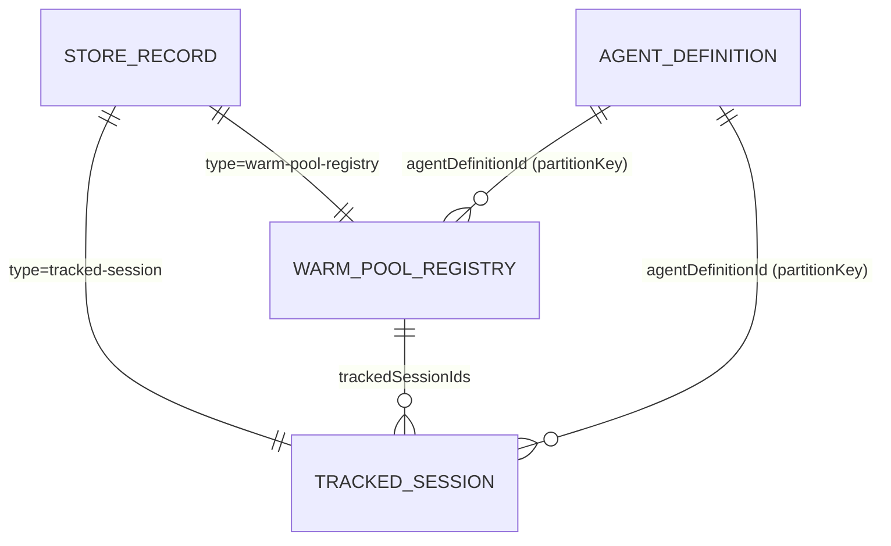

# Modelo de Dados: Stoke Beta

- **Criado em**: 2026-08-21
- **Spec base**: docs/features/stoke-beta/spec.md (v1.2)
- **ADRs**: 0001 (durable store), 0003 (warm-up), 0006 (redação/telemetria)

Este documento descreve os modelos de dados agnósticos de linguagem que a Stoke persiste
no store durável e mantém em memória para o warm-up. Os nomes de campo são conceituais; a
grafia idiomática (snake_case no Python, PascalCase no .NET) segue cada linguagem, mas o
conceito e a semântica são equivalentes (FR-022).

## 1. Registro do store durável (`StoreRecord`)

Unidade genérica persistida por qualquer provider de store durável (ADR 0001). O modelo é
compatível com Cosmos por design, sem acoplar o core a nenhum SDK de store.

| Campo | Tipo | Obrigatório | Descrição |
|-------|------|-------------|-----------|
| `id` | string | Sim | Identificador estável do registro, único dentro da `partitionKey`. |
| `partitionKey` | string | Sim | Chave de partição lógica (mapeia para a partition key do Cosmos). |
| `etag` / `version` | string ou inteiro monotônico | Sim | Token de concorrência otimista. Gravação com valor desatualizado falha por conflito. |
| `type` | string (discriminador) | Sim | Discriminador do payload (ex.: `tracked-session`, `warm-pool-registry`). Permite múltiplos tipos no mesmo store. |
| `payload` | JSON | Sim | Conteúdo serializável em JSON, específico do `type`. |
| `createdAt` | timestamp (UTC, ISO-8601) | Sim | Momento de criação. |
| `updatedAt` | timestamp (UTC, ISO-8601) | Sim | Momento da última gravação bem-sucedida. |

Invariantes:

- A combinação (`id`, `partitionKey`) identifica unicamente o registro (invariante da spec).
- Uma gravação com `etag`/versão desatualizado nunca sobrescreve versão mais recente
  (concorrência otimista sempre honrada; CC-003).

## 2. Registry de warm-pool (`WarmPoolRegistry`) — `type = warm-pool-registry`

Estado do pool de aquecimento por definição de agente (ADR 0003, FR-014, FR-015, CC-006).
Persistido como `StoreRecord` com `partitionKey = agentDefinitionId` e `id` estável do
registry.

| Campo (payload) | Tipo | Obrigatório | Descrição |
|-----------------|------|-------------|-----------|
| `agentDefinitionId` | string | Sim | Identifica a definição de agente hospedada alvo do pool. |
| `targetSize` | inteiro >= 0 | Sim | Tamanho-alvo N de sessões quentes para esta definição (dimensionável por agente). |
| `strategy` | enum (`pre-provision-pool`, `keepalive`) | Sim | Estratégia de aquecimento associada. |
| `trackedSessionIds` | lista de string | Sim | `agent_session_id`s das sessões atualmente rastreadas neste pool. |
| `lastReconciledAt` | timestamp (UTC) | Sim | Última vez que o scheduler reconciliou o pool ao tamanho-alvo. |

Notas:

- Cada definição de agente tem seu próprio registry e `targetSize`, dimensionados de forma
  independente (CC-006).
- A reconciliação (reabastecimento até `targetSize`) é executada pelo scheduler não
  bloqueante (ADR 0003).

## 3. Sessão rastreada (`TrackedSession`) — `type = tracked-session`

Estado de uma sessão de agente rastreada pela Stoke (US1, US3). Persistida como
`StoreRecord` com `partitionKey = agentDefinitionId` e `id = agentSessionId`.

| Campo (payload) | Tipo | Obrigatório | Descrição |
|-----------------|------|-------------|-----------|
| `agentSessionId` | string | Sim | Identificador estável da sessão (`agent_session_id`). |
| `agentDefinitionId` | string | Sim | Definição de agente à qual a sessão pertence. |
| `state` | enum (`Active`, `Idle`, `Resumed`) | Sim | Estado de compute refletido pela Stoke. Mapeado a partir do status oficial via tradução em runtime (enum próprio; strings oficiais não documentadas — ver research.md). |
| `idleTimeoutSeconds` | inteiro (300..3600) | Sim | Idle timeout configurado (5-60 min, padrão 900s). Validado no range; fora dele retorna erro (CC-002). |
| `lastActivityAt` | timestamp (UTC) | Sim | Momento da última atividade conhecida (requisição/probe) que reseta o idle timer. |
| `createdAt` | timestamp (UTC) | Sim | Criação da sessão. |
| `resumedAt` | timestamp (UTC) | Não | Última reativação (Resumed), se houve. |
| `origin` | enum (`pool`, `on-demand`) | Sim | Se a sessão nasceu do pool pré-provisionado ou sob demanda. |

Invariantes:

- Uma sessão encerrada nunca aceita novas operações sem erro determinístico (invariante da
  spec, FR-005).
- `$HOME` e `/files` não são modelados aqui: sua persistência é responsabilidade da
  plataforma, nunca replicada pela Stoke (invariante da spec).

### Nota de segurança: modelo de partição (SEC-009)

O `partitionKey` (= `agentDefinitionId`) é **particionamento lógico**, não uma fronteira de
autorização. Ele não isola tenants nem garante controle de acesso entre definições de
agente; a autorização é responsabilidade do control-plane do Foundry/Entra ID, não do
modelo de dados da Stoke. Adicionalmente, `agentSessionId` é um handle de capacidade
sensível (ver ADR 0006 para o tratamento na telemetria).

## Relações

## Gaps conhecidos / assunções

- Strings exatas do enum de status oficial (Active/Idle/Resumed) não documentadas: a Stoke
  usa enum próprio e traduz em runtime (research.md, ADR 0005).
- Se `GET /sessions/{id}` ou `create_session` resetam o idle timer não está documentado:
  assunção de projeto é que não resetam; `lastActivityAt` é atualizado por atividade de
  probe/requisição (research.md, ADR 0002/0003).
