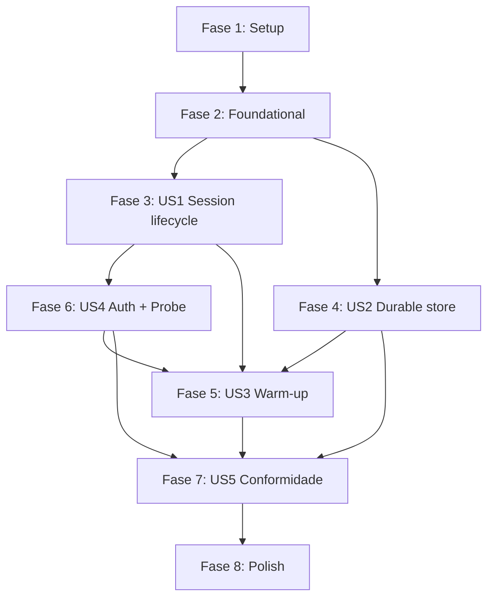

# Decomposição de Tasks: Stoke Beta

- **Criado em**: 2026-08-21
- **Status**: Draft (rascunho local, sem work items em board)
- **Spec base**: docs/features/stoke-beta/spec.md (v1.2)
- **Plan**: docs/features/stoke-beta/plan.md
- **Research**: docs/features/stoke-beta/research.md
- **Data model**: docs/features/stoke-beta/data-model.md
- **Contratos**: docs/features/stoke-beta/contracts/
- **Security review**: docs/features/stoke-beta/security-review-architecture.md (SEC-001..SEC-011)
- **ADRs**: 0001-0007 (todos Proposed; nenhum ADR faltante)

> Escopo do beta: Python (`foundry-stoke`, import `foundry_stoke`) + .NET (`Foundry.Stoke`).
> Go adiado (ADR 0004). Biblioteca de control-plane, sem cliente de data-plane (ADR 0002).
> Monorepo com `python/` e `dotnet/` isolados; fixtures de conformidade agnósticas de
> linguagem em `conformance/`.

## Convenções desta decomposição

- Formato: `- [ ] [P?] T### [SEC-00x?] Descrição com caminho de arquivo (US#, FR-###, ADR ####)`.
- `[P]` marca tasks paralelizáveis (sem dependência entre si dentro da fase).
- Cada User Story começa por um **tracer bullet**: fatia vertical mínima ponta a ponta que
  prova a arquitetura; as tasks seguintes preenchem casos, erros e edge cases.
- Não há tasks de teste separadas: testes fazem parte da aceitação de cada task (fixtures de
  conformidade agnósticas + unit tests por linguagem). O `devsquad.implement` verifica cobertura.
- **Nenhum ADR faltante**: os ADRs 0001-0007 já existem e cobrem todas as decisões técnicas.
  Logo, a fase Foundational não contém tasks bloqueantes de ADR.

---

## Fase 1: Setup (scaffolding + CI)

- [ ] T001 Scaffolding do monorepo: criar estrutura de pastas `python/`, `dotnet/`, `conformance/` com READMEs (raiz do repo) (plan.md Layout de Módulos)
- [ ] [P] T002 Skeleton do projeto Python: `python/pyproject.toml` (foundry-stoke, Python 3.10+, deps mínimas), pacote `python/foundry_stoke/__init__.py`, config `ruff` + `pytest` + type-checker (`python/pyproject.toml`) (plan.md; coding-guidelines)
- [ ] [P] T003 Skeleton do projeto .NET: `dotnet/Foundry.Stoke/Foundry.Stoke.csproj` (.NET 8, nullable enable), projeto de testes `dotnet/Foundry.Stoke.Tests/Foundry.Stoke.Tests.csproj`, config `dotnet format` (coding-guidelines)
- [ ] [P] T004 Diretório de fixtures de conformidade compartilhadas: `conformance/fixtures/` (YAML/JSON) + `conformance/README.md` descrevendo o formato agnóstico de cenário (ADR 0004, FR-022)
- [ ] [P] T005 [CI/CD] Pipeline CI Python (build/lint/test): `.github/workflows/python-ci.yml` (ruff check + format + type-check + pytest) (coding-guidelines)
- [ ] [P] T006 [CI/CD] Pipeline CI .NET (build/lint/test): `.github/workflows/dotnet-ci.yml` (dotnet build + format --verify + dotnet test) (coding-guidelines)
- [ ] [P] T007 [SEC-011] [CI/CD] Postura de supply-chain: lock/pin de dependências (`python/requirements.lock` ou lock do gerenciador; versões fixas no `.csproj`), geração de SBOM, e habilitar Dependabot/scanning (`.github/dependabot.yml`, `.github/workflows/supply-chain.yml`) (plan.md Empacotamento/Release)
- [ ] [P] T008 [SEC-011] [CI/CD] Pipeline de release Python independente: publicação PyPI via Trusted Publishing/OIDC (provenance) (`.github/workflows/python-release.yml`) (ADR 0004; plan.md)
- [ ] [P] T009 [SEC-011] [CI/CD] Pipeline de release .NET independente: publicação NuGet com package signing (`.github/workflows/dotnet-release.yml`) (ADR 0004; plan.md)

---

## Fase 2: Foundational (pré-requisitos transversais)

Sem tasks de ADR faltante (0001-0007 já existem). Estas tasks são primitivas transversais
usadas por múltiplas User Stories.

- [ ] [P] T010 Tipos de erro tipados (Python): conflito de concorrência, sessão encerrada, credencial ausente, idle timeout inválido (`python/foundry_stoke/errors.py`) (contracts/README; FR-005)
- [ ] [P] T011 Tipos de erro/exceção tipados (.NET): equivalentes semânticos (`dotnet/Foundry.Stoke/Errors/`) (contracts/README; FR-005)
- [ ] [P] T012 Base de telemetria OpenTelemetry namespace `stoke.*` (Python): spans/atributos comuns, sem emitir segredos (`python/foundry_stoke/observability.py`) (FR-024, ADR 0006)
- [ ] [P] T013 Base de telemetria OpenTelemetry namespace `stoke.*` (.NET): equivalente (`dotnet/Foundry.Stoke/Observability/`) (FR-024, ADR 0006)
- [ ] [P] T014 Abstração Clock/Scheduler não bloqueante (Python): `Clock`/`Scheduler` com delay async (asyncio) + `VirtualClock` para testes determinísticos (`python/foundry_stoke/scheduling/clock.py`) (ADR 0003; contracts/clock-scheduler.md)
- [ ] [P] T015 Abstração Clock/Scheduler não bloqueante (.NET): `IClock`/`IScheduler` (`PeriodicTimer`, sem `Thread.Sleep`) + `VirtualClock` (`dotnet/Foundry.Stoke/Scheduling/`) (ADR 0003; contracts/clock-scheduler.md)
- [ ] [P] T016 Entrypoint `StokeClient` skeleton (Python): composição de providers/estratégias (`python/foundry_stoke/client.py`) (plan.md)
- [ ] [P] T017 Entrypoint `StokeClient` skeleton (.NET): equivalente (`dotnet/Foundry.Stoke/StokeClient.cs`) (plan.md)

---

## Fase 3: US1 - Controlar ciclo de vida de sessão (P1)

Depende de: T010-T017 (foundational) e da `CredentialProvider` primária (T052/T058 em US4;
usar `DefaultAzureCredential` primário). Componente: session lifecycle / `SessionController`.

- [ ] T018 Fixtures de conformidade do ciclo de sessão: `conformance/fixtures/session-lifecycle.yaml` cobrindo CC-001 (ciclo feliz) e CC-002 (idle timeout inválido) (FR-001..FR-005, ADR 0004)
- [ ] T019 **Tracer bullet** `SessionController` (Python): abrir sessão + consultar estado + tradução do enum de status para `Active/Idle/Resumed` via `azure-ai-projects` (`python/foundry_stoke/session/controller.py`) (US1, FR-001, FR-002, ADR 0002, ADR 0005)
- [ ] T020 Validação de idle timeout 5-60 min (padrão 900s) com erro tipado fora do range (Python) (`python/foundry_stoke/session/controller.py`) (US1, FR-004, CC-002)
- [ ] T021 Stop/Delete de sessão + erro determinístico em operações sobre sessão encerrada (Python) (`python/foundry_stoke/session/controller.py`) (US1, FR-003, FR-005, invariante)
- [ ] [P] T022 `SessionController` (.NET) via REST fallback atrás de `ISessionController` (create/get/stop/delete) usando pipeline `Azure.Core`/`AIProjectClient` (`dotnet/Foundry.Stoke/Session/SessionController.cs`) (US1, FR-001, FR-002, ADR 0005)
- [ ] [P] T023 Validação de idle timeout 5-60 min + erro tipado (.NET) (`dotnet/Foundry.Stoke/Session/SessionController.cs`) (US1, FR-004, CC-002)
- [ ] [P] T024 Stop/Delete + erro determinístico em sessão encerrada (.NET) (`dotnet/Foundry.Stoke/Session/SessionController.cs`) (US1, FR-003, FR-005)
- [ ] T025 Spans `stoke.session.create/get/stop/delete` na camada de sessão (Python + .NET) (`python/foundry_stoke/session/`, `dotnet/Foundry.Stoke/Session/`) (FR-024, plan.md Observabilidade)

---

## Fase 4: US2 - Persistir/recuperar estado via store durável desacoplado (P1)

Independente de US1 (pode iniciar em paralelo). Componente: durable store.

- [ ] T026 Fixtures de conformidade do store: `conformance/fixtures/durable-store.yaml` cobrindo CC-003 (concorrência otimista) e CC-004 (core sem Cosmos) (FR-006..FR-011, ADR 0001)
- [ ] T027 Interface `DurableStoreProvider` (Protocol/ABC) + modelo `StoreRecord` (id, partitionKey, etag/version, type, payload JSON, timestamps) (Python) (`python/foundry_stoke/store/provider.py`) (US2, FR-006, FR-007, FR-008, ADR 0001, data-model.md)
- [ ] T028 **Tracer bullet** `InMemoryStore` (Python): CRUD + query-por-partição + concorrência otimista por etag (`python/foundry_stoke/store/in_memory.py`) (US2, FR-010, CC-003)
- [ ] T029 `FileSystemStore` (Python): CRUD + serialização JSON + concorrência otimista, persistência entre reinícios (`python/foundry_stoke/store/file_system.py`) (US2, FR-010)
- [ ] T030 [SEC-001] Sanitização de path no `FileSystemStore` (Python): derivar nome por hash estável (SHA-256) confinado a diretório base, validar caminho canônico, rejeitar chaves vazias/acima do limite (`python/foundry_stoke/store/file_system.py`) (ADR 0001, SEC-001)
- [ ] T031 [SEC-002] Desserialização segura por schema (Python): usar `json` (nunca `pickle`/`eval`), allowlist de `type` (`tracked-session`, `warm-pool-registry`), tratamento de arquivo corrompido/parcial com erro tipado, limite de tamanho de arquivo/payload (`python/foundry_stoke/store/file_system.py`) (ADR 0001, SEC-002)
- [ ] T032 [SEC-006] Ciclo read-check-etag-write sob o mesmo advisory lock cross-process (`fcntl.flock`/`msvcrt.locking`) + timeout de aquisição com erro tipado (Python) (`python/foundry_stoke/store/file_system.py`) (ADR 0001, SEC-006)
- [ ] [P] T033 Interface `IDurableStoreProvider` + `StoreRecord` (.NET) (`dotnet/Foundry.Stoke/Store/IDurableStoreProvider.cs`) (US2, FR-006, FR-007, FR-008, ADR 0001)
- [ ] [P] T034 `InMemoryStore` (.NET): CRUD + query-por-partição + concorrência otimista (`dotnet/Foundry.Stoke/Store/InMemoryStore.cs`) (US2, FR-010, CC-003)
- [ ] [P] T035 `FileSystemStore` (.NET): CRUD + JSON + concorrência otimista, persistência entre reinícios (`dotnet/Foundry.Stoke/Store/FileSystemStore.cs`) (US2, FR-010)
- [ ] [P] T036 [SEC-001] Sanitização de path no `FileSystemStore` (.NET): hash estável + `Path.GetFullPath` confinado à base, rejeitar chaves inválidas/nomes reservados (`dotnet/Foundry.Stoke/Store/FileSystemStore.cs`) (ADR 0001, SEC-001)
- [ ] [P] T037 [SEC-002] Desserialização segura por schema (.NET): `System.Text.Json` sem `TypeNameHandling`, allowlist de `type`, arquivo corrompido com erro tipado, limite de tamanho (`dotnet/Foundry.Stoke/Store/FileSystemStore.cs`) (ADR 0001, SEC-002)
- [ ] [P] T038 [SEC-006] Ciclo read-check-etag-write sob lock (`FileStream` com `FileShare.None`) + timeout de aquisição (.NET) (`dotnet/Foundry.Stoke/Store/FileSystemStore.cs`) (ADR 0001, SEC-006)
- [ ] T039 Teste de inspeção de dependências: core sem SDK do Cosmos em nenhum caminho (Python + .NET) (`python/tests/test_no_cosmos_dependency.py`, `dotnet/Foundry.Stoke.Tests/NoCosmosDependencyTests.cs`) (US2, FR-011, SC-002, CC-004, invariante)
- [ ] T040 Spans `stoke.store.read/write` na camada de store (Python + .NET) (`python/foundry_stoke/store/`, `dotnet/Foundry.Stoke/Store/`) (FR-024)

---

## Fase 5: US3 - Manter agentes aquecidos por estratégia plugável (P2)

Depende de: US2 (registry no store), `SessionController` (US1/US4) e Clock/Scheduler (T014/T015).
Componente: warm-up.

- [ ] T041 Fixtures de conformidade de warm-up: `conformance/fixtures/warmup.yaml` cobrindo CC-006 (pool por definição de agente) e keepalive dentro da janela de idle (FR-012..FR-015, ADR 0003)
- [ ] T042 Interface `WarmupStrategy` selecionável pelo usuário (Python) (`python/foundry_stoke/warmup/strategy.py`) (US3, FR-012, ADR 0003)
- [ ] T043 **Tracer bullet** `KeepaliveStrategy` (Python): executa `WarmupProbe` dentro da janela de idle via clock injetado, renovando a sessão sob `VirtualClock` (`python/foundry_stoke/warmup/keepalive.py`) (US3, FR-013, ADR 0003)
- [ ] T044 `PreProvisionPoolStrategy` (Python): pool de N sessões quentes por definição de agente, reabastecimento até `targetSize`, persistência do `WarmPoolRegistry` no store (`python/foundry_stoke/warmup/pool.py`) (US3, FR-014, FR-015, CC-006, data-model.md)
- [ ] T045 [SEC-007] Teto configurável de `targetSize` + backoff exponencial com jitter + teto de tentativas em falha de reconciliação + métrica `stoke.warmup.refill` (Python) (`python/foundry_stoke/warmup/pool.py`) (ADR 0003, SEC-007)
- [ ] [P] T046 Interface `IWarmupStrategy` (.NET) (`dotnet/Foundry.Stoke/Warmup/IWarmupStrategy.cs`) (US3, FR-012, ADR 0003)
- [ ] [P] T047 `KeepaliveStrategy` (.NET) via `BackgroundService`/`PeriodicTimer` + clock injetado (`dotnet/Foundry.Stoke/Warmup/KeepaliveStrategy.cs`) (US3, FR-013, ADR 0003)
- [ ] [P] T048 `PreProvisionPoolStrategy` (.NET): pool por definição, reabastecimento até `targetSize`, `WarmPoolRegistry` no store (`dotnet/Foundry.Stoke/Warmup/PreProvisionPoolStrategy.cs`) (US3, FR-014, FR-015, CC-006)
- [ ] [P] T049 [SEC-007] Teto de `targetSize` + backoff/jitter + teto de tentativas + métrica `stoke.warmup.refill` (.NET) (`dotnet/Foundry.Stoke/Warmup/PreProvisionPoolStrategy.cs`) (ADR 0003, SEC-007)
- [ ] T050 Spans `stoke.warmup.probe/refill` na camada de warm-up (Python + .NET) (`python/foundry_stoke/warmup/`, `dotnet/Foundry.Stoke/Warmup/`) (FR-024)

---

## Fase 6: US4 - Integrar Foundry no control-plane com probe plugável e auth segura (P2)

Depende de: US1 (`SessionController`). Componente: auth (`CredentialProvider`), probe
(`WarmupProbe`), telemetria de segredos.

- [ ] T051 Fixtures de conformidade de auth + probe: `conformance/fixtures/auth-probe.yaml` cobrindo CC-005 (fallback de auth) e CC-007 (keepalive por probe do usuário) (FR-016..FR-020, ADR 0005, 0007)
- [ ] T052 **Tracer bullet** `CredentialProvider` (Python): `DefaultAzureCredential` primário + precedência de fallback por API key/connection string quando o primário indisponível; erro claro sem credencial (`python/foundry_stoke/auth/credential_provider.py`) (US4, FR-019, FR-020, CC-005, ADR 0005)
- [ ] T053 [SEC-004] Credencial determinística em produção (Python): suporte a `AZURE_TOKEN_CREDENTIALS=prod` e injeção de `TokenCredential` explícito + documentação (`python/foundry_stoke/auth/credential_provider.py`) (ADR 0005, SEC-004)
- [ ] T054 [SEC-005] Segredos nunca persistidos no store + precedência de fallback + tempo de vida em memória minimizado + sem exposição em `repr`/`str` (Python) (`python/foundry_stoke/auth/credential_provider.py`) (ADR 0005, ADR 0006, SEC-005)
- [ ] T055 Abstração `WarmupProbe` + `ResponsesPingProbe` embutido (opcional) + hook de probe fornecido pelo usuário para Invocations/containers (Python) (`python/foundry_stoke/warmup/probe.py`) (US4, FR-017, contracts/warmup-probe.md)
- [ ] T056 [SEC-010] Endpoint de probe apenas de config de confiança (esquema https + host esperado); nenhuma credencial anexada ao probe do usuário (Python) (`python/foundry_stoke/warmup/probe.py`) (ADR 0007, SEC-010)
- [ ] T057 [SEC-008] Modelo de confiança de providers plugáveis (Python): Stoke nunca passa segredos ao provider de store nem ao probe; valida invariantes dos registros retornados (chaves não vazias, `type` na allowlist) (`python/foundry_stoke/store/provider.py`, `python/foundry_stoke/warmup/probe.py`) (ADR 0007, SEC-008)
- [ ] [P] T058 `ICredentialProvider` (.NET): `DefaultAzureCredential` primário + fallback; credencial reusada no caminho REST fallback do `SessionController` (`dotnet/Foundry.Stoke/Auth/CredentialProvider.cs`) (US4, FR-019, FR-020, CC-005, ADR 0005)
- [ ] [P] T059 [SEC-004] Credencial determinística em produção (.NET): `AZURE_TOKEN_CREDENTIALS`/`ManagedIdentityCredential` injetável + doc (`dotnet/Foundry.Stoke/Auth/CredentialProvider.cs`) (ADR 0005, SEC-004)
- [ ] [P] T060 [SEC-005] Segredos nunca persistidos + precedência de fallback + tempo de vida minimizado (`char[]`/`SecureString` onde aplicável), sem `ToString` (.NET) (`dotnet/Foundry.Stoke/Auth/CredentialProvider.cs`) (ADR 0005, ADR 0006, SEC-005)
- [ ] [P] T061 `IWarmupProbe` + `ResponsesPingProbe` + hook do usuário (.NET) (`dotnet/Foundry.Stoke/Warmup/WarmupProbe.cs`) (US4, FR-017, contracts/warmup-probe.md)
- [ ] [P] T062 [SEC-010] Validação do endpoint de probe (https + host esperado), sem credenciais anexadas ao probe do usuário (.NET) (`dotnet/Foundry.Stoke/Warmup/WarmupProbe.cs`) (ADR 0007, SEC-010)
- [ ] [P] T063 [SEC-008] Modelo de confiança de providers plugáveis (.NET): nunca passar segredos + validar invariantes de registros retornados (`dotnet/Foundry.Stoke/Store/IDurableStoreProvider.cs`, `dotnet/Foundry.Stoke/Warmup/WarmupProbe.cs`) (ADR 0007, SEC-008)
- [ ] T064 [SEC-003] Política de redação por allowlist na telemetria (Python): nunca emitir connection string/API key/token/endpoint-com-chave/payload; sanitizar mensagens de exceção; teste de ausência de padrões de segredo (`python/foundry_stoke/observability.py`, `python/tests/test_no_secret_in_telemetry.py`) (ADR 0006, SEC-003)
- [ ] [P] T065 [SEC-003] Política de redação por allowlist na telemetria (.NET) + teste de no-secret-pattern (`dotnet/Foundry.Stoke/Observability/`, `dotnet/Foundry.Stoke.Tests/NoSecretInTelemetryTests.cs`) (ADR 0006, SEC-003)
- [ ] T066 [SEC-009] `agent_session_id` tratado como sensível na telemetria (Python): omitir/truncar/hashear em spans de baixa severidade + nota "partição não é authz" no data-model (`python/foundry_stoke/observability.py`) (ADR 0006, SEC-009, data-model.md)
- [ ] [P] T067 [SEC-009] `agent_session_id` sensível na telemetria (.NET) (`dotnet/Foundry.Stoke/Observability/`) (ADR 0006, SEC-009)

---

## Fase 7: US5 - Usar API equivalente entre linguagens (P3)

Propriedade transversal, validada após as capacidades funcionais. Componente: conformance suite.

- [ ] T068 Harness fino de conformidade (Python): executa as fixtures agnósticas de `conformance/fixtures/` e valida equivalência semântica (`python/tests/conformance/`) (US5, FR-022, SC-001, ADR 0004)
- [ ] [P] T069 Harness fino de conformidade (.NET): executa as mesmas fixtures (`dotnet/Foundry.Stoke.Tests/Conformance/`, `Category=Conformance`) (US5, FR-022, SC-001, ADR 0004)
- [ ] T070 [CI/CD] Verificação de equivalência CC-001..CC-007 entre Python e .NET integrada ao CI (gate de release) (`.github/workflows/python-ci.yml`, `.github/workflows/dotnet-ci.yml`) (US5, SC-001, ADR 0004)

---

## Fase 8: Polish e Cross-Cutting

- [ ] [P] T071 [Monitoring] Dashboards/alertas para métricas `stoke.*` (session, warmup.refill, store) no Application Insights (`docs/features/stoke-beta/observability-runbook.md`) (FR-024, plan.md Observabilidade)
- [ ] T072 [Runbook] Documentação operacional: rollback, troubleshooting de warm-pool, limitações do advisory file-lock (NFS/SMB), credencial determinística em prod (`docs/features/stoke-beta/observability-runbook.md`) (ADR 0001, 0003, 0005; SEC-004, SEC-006, SEC-007)
- [ ] [P] T073 README de uso + metadados de empacotamento por linguagem (`python/README.md`, `dotnet/README.md`) (plan.md Empacotamento/Release)
- [ ] T074 [SEC-011] [CI/CD] Dry-run de release independente (PyPI + NuGet) validando SBOM, assinatura e provenance antes do primeiro publish (`.github/workflows/python-release.yml`, `.github/workflows/dotnet-release.yml`) (ADR 0004; SEC-011)

---

## Rastreabilidade: Task -> US / FR / ADR / SEC

| Task(s) | US | FR | ADR | SEC | Componente |
|---------|----|----|-----|-----|-----------|
| T001-T004 | — | — | 0004 | — | scaffolding |
| T005-T006, T070 | US5 | FR-022 | 0004 | — | CI |
| T007-T009, T074 | — | — | 0004 | SEC-011 | CI/release/supply-chain |
| T010-T011 | — | FR-005 | — | — | erros |
| T012-T013 | — | FR-024 | 0006 | — | observabilidade |
| T014-T015 | US3/US4 | — | 0003 | — | clock/scheduler |
| T016-T017 | — | — | — | — | entrypoint |
| T018-T025 | US1 | FR-001..FR-005 | 0002, 0005 | — | session lifecycle |
| T026-T040 | US2 | FR-006..FR-011 | 0001 | SEC-001, SEC-002, SEC-006 | durable store |
| T041-T050 | US3 | FR-012..FR-015 | 0003 | SEC-007 | warm-up |
| T051-T063 | US4 | FR-016..FR-020 | 0005, 0007 | SEC-004, SEC-005, SEC-008, SEC-010 | auth + probe |
| T064-T067 | US4 | FR-024 | 0006 | SEC-003, SEC-009 | telemetria (segredos) |
| T068-T070 | US5 | FR-021, FR-022 | 0004 | — | conformidade |
| T071-T073 | — | FR-024 | 0001, 0003, 0005 | — | monitoring/runbook/docs |

### Cobertura das 11 mitigações de segurança

| SEC | Descrição | Tasks | ADR |
|-----|-----------|-------|-----|
| SEC-001 | Sanitização de path (FileSystem) | T030 (py), T036 (.NET) | 0001 |
| SEC-002 | Desserialização segura + arquivo corrompido + limite | T031 (py), T037 (.NET) | 0001 |
| SEC-003 | Redação de telemetria por allowlist + teste no-secret | T064 (py), T065 (.NET) | 0006 |
| SEC-004 | Credencial determinística em prod + docs | T053 (py), T059 (.NET) | 0005 |
| SEC-005 | Segredos nunca persistidos + precedência + vida mínima | T054 (py), T060 (.NET) | 0005 |
| SEC-006 | Read-modify-write sob lock + timeout | T032 (py), T038 (.NET) | 0001 |
| SEC-007 | Teto de `targetSize` + backoff/jitter + métrica refill | T045 (py), T049 (.NET) | 0003 |
| SEC-008 | Trust de providers/probe + validar invariantes | T057 (py), T063 (.NET) | 0007 |
| SEC-009 | `agent_session_id` sensível + nota partição-não-authz | T066 (py), T067 (.NET) | 0006 |
| SEC-010 | Endpoint de probe de config confiável (https + host) | T056 (py), T062 (.NET) | 0007 |
| SEC-011 | Supply-chain: pin/lock, SBOM, assinatura, scanning | T007, T008, T009, T074 | plan.md |

Todas as 11 mitigações têm task(s) explícita(s) referenciando o SEC-00x e o ADR/registro.

### Conformance Cases -> Fixtures

| CC | Cenário | Fixture |
|----|---------|---------|
| CC-001 | Ciclo de sessão feliz | session-lifecycle.yaml (T018) |
| CC-002 | Idle timeout inválido | session-lifecycle.yaml (T018) |
| CC-003 | Concorrência otimista no store | durable-store.yaml (T026) |
| CC-004 | Core sem Cosmos | durable-store.yaml (T026) + T039 |
| CC-005 | Fallback de autenticação | auth-probe.yaml (T051) |
| CC-006 | Pool por definição de agente | warmup.yaml (T041) |
| CC-007 | Keepalive por probe do usuário | auth-probe.yaml (T051) |

---

## Guia de Paralelização e Ordem

### Grafo de dependências entre fases

### Regras de paralelização

- **Entre linguagens**: para toda capacidade, as tasks `python/` e `dotnet/` são paralelas
  entre si (implementações isoladas; sem build/fonte compartilhados). As fixtures agnósticas
  (`conformance/`) são a fonte única de verdade que ambas consomem.
- **US1 e US2 (P1)** podem ser desenvolvidas em paralelo: o store durável (US2) é totalmente
  independente do control-plane; é o tracer mais isolado e pode iniciar assim que a Fase 2
  terminar.
- **US4 (auth)** deve preceder o uso pleno de credenciais em US1: a `CredentialProvider`
  primária (T052/T058) é pré-requisito do `SessionController` real. Sequenciar T052/T058
  cedo, mesmo estando rotuladas em US4.
- **US3 (warm-up)** depende de US2 (registry no store), do `SessionController` (US1) e do
  `WarmupProbe` (US4). É a última capacidade funcional.
- **US5 (conformidade)** é executada após as capacidades funcionais; os harness por linguagem
  (T068/T069) são paralelos entre si.
- **Tasks `[P]` dentro de uma mesma fase** não têm dependência entre si e podem ser tocadas
  concorrentemente.
- **Tasks de segurança** acompanham a task de implementação do componente correspondente na
  mesma fase (ex.: SEC-001/002/006 dentro de US2; SEC-004/005/008/010 dentro de US4). Não são
  fase separada: são aceitação obrigatória do componente.

---

## Reasoning Log

- **2026-08-21 — Organização por User Story + componente, para py e .NET.** Seguindo
  tasks.instructions e o pedido do conductor, cada US (P1..P3) é uma fase com tracer bullet;
  dentro de cada uma, os pares Python/.NET são paralelos e ancorados em fixtures agnósticas.
- **Nenhum ADR faltante.** Os ADRs 0001-0007 já cobrem todas as decisões técnicas
  (store, boundary, warm-up/scheduler, cross-language, auth, redação, trust). A Fase Foundational
  não contém tasks bloqueantes de ADR; contém apenas primitivas transversais (erros, telemetria
  base, clock/scheduler, entrypoint).
- **Todas as 11 mitigações SEC viraram tasks explícitas** referenciando o SEC-00x e o ADR/registro
  que a documenta, distribuídas no componente correspondente (não em fase separada), pois são
  aceitação obrigatória (security-review APPROVED_WITH_CONTROLS).
- **Sem tasks de IaC**: o beta é uma biblioteca de control-plane sem provisionamento de
  infraestrutura própria (ADR 0002). As tasks DevSecOps aplicáveis são [CI/CD], [Monitoring]
  e [Runbook]. Supply-chain (SEC-011) entra como [CI/CD].
- **Ordenação TDD**: cada US começa pela fixture de conformidade (comportamento esperado) antes
  da implementação do tracer, consistente com test-discipline e ADR 0004.
- **Rascunho local apenas**: por decisão do usuário (exposição de tasks sensíveis de segurança),
  nenhum work item é criado em board (GitHub Issues/Azure DevOps).
