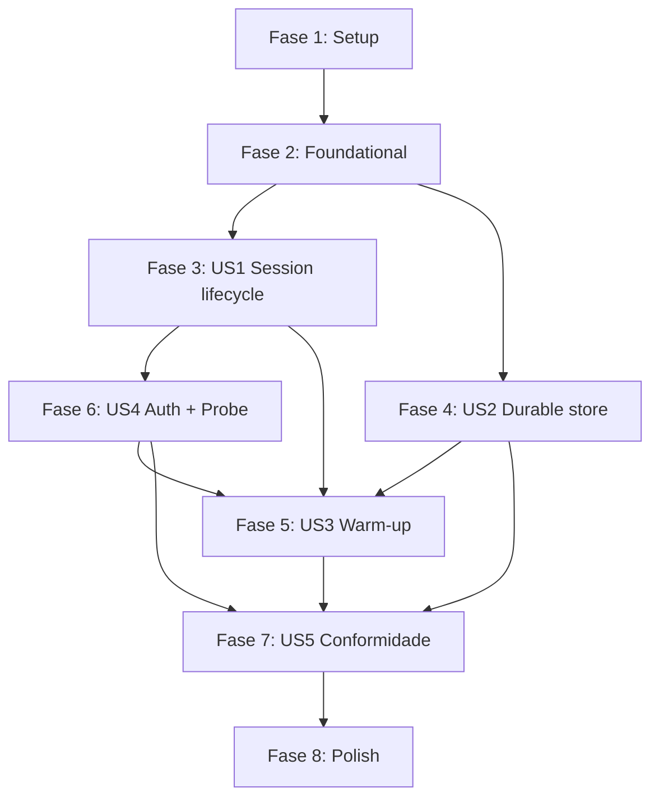

# Decomposição de Tasks: Stoke Beta

- **Criado em**: 2026-08-21
- **Status**: Draft (rascunho local, sem work items em board)
- **Spec base**: docs/features/stoke-beta/spec.md (v1.2)
- **Plan**: docs/features/stoke-beta/plan.md
- **Research**: docs/features/stoke-beta/research.md
- **Data model**: docs/features/stoke-beta/data-model.md
- **Contratos**: docs/features/stoke-beta/contracts/
- **Security review**: docs/features/stoke-beta/security-review-architecture.md (SEC-001..SEC-011)
- **ADRs**: 0001-0007 (todos Proposed; nenhum ADR faltante)

> Escopo do beta: Python (`foundry-stoke`, import `foundry_stoke`) + .NET (`Foundry.Stoke`).
> Go adiado (ADR 0004). Biblioteca de control-plane, sem cliente de data-plane (ADR 0002).
> Monorepo com `python/` e `dotnet/` isolados; fixtures de conformidade agnósticas de
> linguagem em `conformance/`.

## Convenções desta decomposição

- Formato: `- [ ] [P?] T### [SEC-00x?] Descrição com caminho de arquivo (US#, FR-###, ADR ####)`.
- `[P]` marca tasks paralelizáveis (sem dependência entre si dentro da fase).
- Cada User Story começa por um **tracer bullet**: fatia vertical mínima ponta a ponta que
  prova a arquitetura; as tasks seguintes preenchem casos, erros e edge cases.
- Não há tasks de teste separadas: testes fazem parte da aceitação de cada task (fixtures de
  conformidade agnósticas + unit tests por linguagem). O `devsquad.implement` verifica cobertura.
- **Nenhum ADR faltante**: os ADRs 0001-0007 já existem e cobrem todas as decisões técnicas.
  Logo, a fase Foundational não contém tasks bloqueantes de ADR.

---

## Fase 1: Setup (scaffolding + CI)

- [x] T001 Scaffolding do monorepo: criar estrutura de pastas `python/`, `dotnet/`, `conformance/` com READMEs (raiz do repo) (plan.md Layout de Módulos)
- [x] [P] T002 Skeleton do projeto Python: `python/pyproject.toml` (foundry-stoke, Python 3.10+, deps mínimas), pacote `python/foundry_stoke/__init__.py`, config `ruff` + `pytest` + type-checker (`python/pyproject.toml`) (plan.md; coding-guidelines)
- [x] [P] T003 Skeleton do projeto .NET: `dotnet/Foundry.Stoke/Foundry.Stoke.csproj` (.NET 8, nullable enable), projeto de testes `dotnet/Foundry.Stoke.Tests/Foundry.Stoke.Tests.csproj`, config `dotnet format` (coding-guidelines)
- [x] [P] T004 Diretório de fixtures de conformidade compartilhadas: `conformance/fixtures/` (JSON) + `conformance/README.md` descrevendo o formato agnóstico de cenário (ADR 0004, FR-022)
- [x] [P] T005 [CI/CD] Pipeline CI Python (build/lint/test): `.github/workflows/ci.yml` (ruff check + format + type-check + pytest; matriz 3.10-3.13; core sem azure prova CC-004 + job com extra azure) (coding-guidelines)
- [x] [P] T006 [CI/CD] Pipeline CI .NET (build/lint/test): `.github/workflows/dotnet-ci.yml` (dotnet build + format --verify + dotnet test) (coding-guidelines)
- [x] [P] T007 [SEC-011] [CI/CD] Postura de supply-chain (Python): Dependabot (`pip` em `/python` + `github-actions` em `/`), SBOM CycloneDX no build de release; core zero-dep sem lockfile (pin via workflow) (`.github/dependabot.yml`, `.github/workflows/release.yml`) — .NET (`.csproj` pin + signing) pendente (plan.md Empacotamento/Release)
- [x] [P] T008 [SEC-011] [CI/CD] Pipeline de release Python independente: publicação PyPI via Trusted Publishing/OIDC, tag `python-v*`, gate TestPyPI (dry-run) -> PyPI (environment protegido) (`.github/workflows/release.yml`) (ADR 0004; plan.md)
- [ ] [P] T009 [SEC-011] [CI/CD] Pipeline de release .NET independente: publicação NuGet com package signing (`.github/workflows/dotnet-release.yml`) (ADR 0004; plan.md)

---

## Fase 2: Foundational (pré-requisitos transversais)

Sem tasks de ADR faltante (0001-0007 já existem). Estas tasks são primitivas transversais
usadas por múltiplas User Stories.

- [x] [P] T010 Tipos de erro tipados (Python): conflito de concorrência, sessão encerrada, credencial ausente, idle timeout inválido (`python/foundry_stoke/errors.py`) (contracts/README; FR-005)
- [x] [P] T011 Tipos de erro/exceção tipados (.NET): equivalentes semânticos (`dotnet/Foundry.Stoke/Errors/`) (contracts/README; FR-005)
- [x] [P] T012 Base de telemetria OpenTelemetry namespace `stoke.*` (Python): spans/atributos comuns, sem emitir segredos (`python/foundry_stoke/observability.py`) (FR-024, ADR 0006)
- [x] [P] T013 Base de telemetria OpenTelemetry namespace `stoke.*` (.NET): equivalente (`dotnet/Foundry.Stoke/Observability/`) (FR-024, ADR 0006)
- [x] [P] T014 Abstração Clock/Scheduler não bloqueante (Python): `Clock`/`Scheduler` com delay async (asyncio) + `VirtualClock` para testes determinísticos (`python/foundry_stoke/scheduling/clock.py`) (ADR 0003; contracts/clock-scheduler.md)
- [x] [P] T015 Abstração Clock/Scheduler não bloqueante (.NET): `IClock` + `SystemClock` (`Task.Delay`, sem `Thread.Sleep`) + `VirtualClock` determinístico (`dotnet/Foundry.Stoke/Scheduling/`) (ADR 0003; contracts/clock-scheduler.md)
- [ ] [P] T016 Entrypoint `StokeClient` skeleton (Python): composição de providers/estratégias (`python/foundry_stoke/client.py`) (plan.md)
- [x] [P] T017 Entrypoint `StokeClient` skeleton (.NET): equivalente (`dotnet/Foundry.Stoke/StokeClient.cs`) (plan.md)

---

## Fase 3: US1 - Controlar ciclo de vida de sessão (P1)

Depende de: T010-T017 (foundational) e da `CredentialProvider` primária (T052/T058 em US4;
usar `DefaultAzureCredential` primário). Componente: session lifecycle / `SessionController`.

- [x] T018 Fixtures de conformidade do ciclo de sessão: `conformance/fixtures/session-lifecycle.json` cobrindo CC-001 (ciclo feliz) e CC-002 (idle timeout inválido) (FR-001..FR-005, ADR 0004)
- [x] T019 **Tracer bullet** `SessionController` (Python): abrir sessão + consultar estado + tradução do enum de status para `Active/Idle/Resumed` via `azure-ai-projects` (`python/foundry_stoke/session/controller.py`) (US1, FR-001, FR-002, ADR 0002, ADR 0005)
- [x] T020 Validação de idle timeout 5-60 min (padrão 900s) com erro tipado fora do range (Python) (`python/foundry_stoke/session/controller.py`) (US1, FR-004, CC-002)
- [x] T021 Stop/Delete de sessão + erro determinístico em operações sobre sessão encerrada (Python) (`python/foundry_stoke/session/controller.py`) (US1, FR-003, FR-005, invariante)
- [x] [P] T022 `SessionController` (.NET) atrás da porta `ISessionOperations` (create/get/list/stop/delete); `StatusTranslator` case-insensitive sobre a taxonomia oficial + `UNKNOWN`; resume derivado idle->active (`dotnet/Foundry.Stoke/Session/SessionController.cs`) (US1, FR-001, FR-002, ADR 0002, ADR 0005). Adapter REST real fica fora desta fatia (seam vivo).
- [x] [P] T023 Validação de idle timeout 5-60 min + erro tipado (.NET) (`dotnet/Foundry.Stoke/Session/SessionController.cs`) (US1, FR-004, CC-002)
- [x] [P] T024 Stop/Delete + erro determinístico em sessão encerrada (.NET) (`dotnet/Foundry.Stoke/Session/SessionController.cs`) (US1, FR-003, FR-005)
- [x] T025 Spans `stoke.session.create/get/stop/delete` na camada de sessão (Python + .NET) (`python/foundry_stoke/session/`, `dotnet/Foundry.Stoke/Session/`) (FR-024, plan.md Observabilidade)

---

## Fase 4: US2 - Persistir/recuperar estado via store durável desacoplado (P1)

Independente de US1 (pode iniciar em paralelo). Componente: durable store.

- [x] T026 Fixtures de conformidade do store: `conformance/fixtures/durable-store.json` cobrindo CC-003 (concorrência otimista) e CC-004 (core sem Cosmos) (FR-006..FR-011, ADR 0001)
- [x] T027 Interface `DurableStoreProvider` (Protocol/ABC) + modelo `StoreRecord` (id, partitionKey, etag/version, type, payload JSON, timestamps) (Python) (`python/foundry_stoke/store/provider.py`) (US2, FR-006, FR-007, FR-008, ADR 0001, data-model.md)
- [x] T028 **Tracer bullet** `InMemoryStore` (Python): CRUD + query-por-partição + concorrência otimista por etag (`python/foundry_stoke/store/in_memory.py`) (US2, FR-010, CC-003)
- [x] T029 `FileSystemStore` (Python): CRUD + serialização JSON + concorrência otimista, persistência entre reinícios (`python/foundry_stoke/store/file_system.py`) (US2, FR-010)
- [x] T030 [SEC-001] Sanitização de path no `FileSystemStore` (Python): derivar nome por hash estável (SHA-256) confinado a diretório base, validar caminho canônico, rejeitar chaves vazias/acima do limite (`python/foundry_stoke/store/file_system.py`) (ADR 0001, SEC-001)
- [x] T031 [SEC-002] Desserialização segura por schema (Python): usar `json` (nunca `pickle`/`eval`), allowlist de `type` (`tracked-session`, `warm-pool-registry`), tratamento de arquivo corrompido/parcial com erro tipado, limite de tamanho de arquivo/payload (`python/foundry_stoke/store/file_system.py`) (ADR 0001, SEC-002)
- [x] T032 [SEC-006] Ciclo read-check-etag-write sob o mesmo advisory lock cross-process (`fcntl.flock`/`msvcrt.locking`) + timeout de aquisição com erro tipado (Python) (`python/foundry_stoke/store/file_system.py`) (ADR 0001, SEC-006)
- [x] [P] T033 Interface `IDurableStoreProvider` + `StoreRecord` (.NET) (`dotnet/Foundry.Stoke/Store/IDurableStoreProvider.cs`) (US2, FR-006, FR-007, FR-008, ADR 0001)
- [x] [P] T034 `InMemoryStore` (.NET): CRUD + query-por-partição + concorrência otimista (`dotnet/Foundry.Stoke/Store/InMemoryStore.cs`) (US2, FR-010, CC-003)
- [x] [P] T035 `FileSystemStore` (.NET): CRUD + JSON + concorrência otimista, persistência entre reinícios (`dotnet/Foundry.Stoke/Store/FileSystemStore.cs`) (US2, FR-010)
- [x] [P] T036 [SEC-001] Sanitização de path no `FileSystemStore` (.NET): hash estável + `Path.GetFullPath` confinado à base, rejeitar chaves inválidas/nomes reservados (`dotnet/Foundry.Stoke/Store/FileSystemStore.cs`) (ADR 0001, SEC-001)
- [x] [P] T037 [SEC-002] Desserialização segura por schema (.NET): `System.Text.Json` sem `TypeNameHandling`, allowlist de `type`, arquivo corrompido com erro tipado, limite de tamanho (`dotnet/Foundry.Stoke/Store/FileSystemStore.cs`) (ADR 0001, SEC-002)
- [x] [P] T038 [SEC-006] Ciclo read-check-etag-write sob lock (`FileStream` com `FileShare.None`) + timeout de aquisição (.NET) (`dotnet/Foundry.Stoke/Store/FileSystemStore.cs`) (ADR 0001, SEC-006)
- [x] T039 Teste de inspeção de dependências: core sem SDK do Cosmos em nenhum caminho (Python + .NET) (`python/tests/test_no_cosmos_dependency.py`, `dotnet/Foundry.Stoke.Tests/NoCosmosDependencyTests.cs`) (US2, FR-011, SC-002, CC-004, invariante)
- [x] T040 Spans `stoke.store.read/write` na camada de store (Python + .NET) (`python/foundry_stoke/store/`, `dotnet/Foundry.Stoke/Store/`) (FR-024)

---

## Fase 5: US3 - Manter agentes aquecidos por estratégia plugável (P2)

Depende de: US2 (registry no store), `SessionController` (US1/US4) e Clock/Scheduler (T014/T015).
Componente: warm-up.

- [x] T041 Fixtures de conformidade de warm-up: `conformance/fixtures/warmup.json` cobrindo CC-006 (pool por definição de agente) e keepalive dentro da janela de idle (FR-012..FR-015, ADR 0003)
- [x] T042 Interface `WarmupStrategy` selecionável pelo usuário (Python) (`python/foundry_stoke/warmup/strategy.py`) (US3, FR-012, ADR 0003)
- [x] T043 **Tracer bullet** `KeepaliveStrategy` (Python): executa `WarmupProbe` dentro da janela de idle via clock injetado, renovando a sessão sob `VirtualClock` (`python/foundry_stoke/warmup/keepalive.py`) (US3, FR-013, ADR 0003)
- [x] T044 `PreProvisionPoolStrategy` (Python): pool de N sessões quentes por definição de agente, reabastecimento até `targetSize`, persistência do `WarmPoolRegistry` no store (`python/foundry_stoke/warmup/pool.py`) (US3, FR-014, FR-015, CC-006, data-model.md)
- [x] T045 [SEC-007] Teto configurável de `targetSize` + backoff exponencial com jitter + teto de tentativas em falha de reconciliação + métrica `stoke.warmup.refill` (Python) (`python/foundry_stoke/warmup/pool.py`) (ADR 0003, SEC-007)
- [x] [P] T046 Interface `IWarmupStrategy` (.NET) + `WarmupReport` (`dotnet/Foundry.Stoke/Warmup/IWarmupStrategy.cs`, `WarmupReport.cs`) (US3, FR-012, ADR 0003)
- [x] [P] T047 `KeepaliveStrategy` (.NET): loop não-bloqueante dirigido pelo `IClock` injetado (espelha o loop asyncio do Python em vez de `BackgroundService`/`PeriodicTimer`, mantendo a lib sem dependências) + probe do usuário (CC-007) (`dotnet/Foundry.Stoke/Warmup/KeepaliveStrategy.cs`) (US3, FR-013, ADR 0003)
- [x] [P] T048 `PreProvisionPoolStrategy` (.NET): pool por definição, reabastecimento até `targetSize`, `WarmPoolRegistry` no store, `_filter_ready` evicta terminais + Unknown (`dotnet/Foundry.Stoke/Warmup/PreProvisionPoolStrategy.cs`) (US3, FR-014, FR-015, CC-006)
- [x] [P] T049 [SEC-007] Teto de `targetSize` + backoff exponencial/full jitter + teto de tentativas + métrica `stoke.warmup.refill` (.NET) (`dotnet/Foundry.Stoke/Warmup/PreProvisionPoolStrategy.cs`) (ADR 0003, SEC-007)
- [x] T050 Spans `stoke.warmup.probe/refill` na camada de warm-up (Python + .NET) (`python/foundry_stoke/warmup/`, `dotnet/Foundry.Stoke/Warmup/`) (FR-024)

---

## Fase 6: US4 - Integrar Foundry no control-plane com probe plugável e auth segura (P2)

Depende de: US1 (`SessionController`). Componente: auth (`CredentialProvider`), probe
(`WarmupProbe`), telemetria de segredos.

- [x] T051 Fixtures de conformidade de auth + probe: `conformance/fixtures/auth-probe.json` cobrindo CC-005 (fallback de auth) e CC-007 (keepalive por probe do usuário) (FR-016..FR-020, ADR 0005, 0007)
- [x] T052 **Tracer bullet** `CredentialProvider` (Python): `DefaultAzureCredential` primário + precedência de fallback por API key/connection string quando o primário indisponível; erro claro sem credencial (`python/foundry_stoke/auth/credential_provider.py`) (US4, FR-019, FR-020, CC-005, ADR 0005)
- [x] T053 [SEC-004] Credencial determinística em produção (Python): suporte a `AZURE_TOKEN_CREDENTIALS=prod` e injeção de `TokenCredential` explícito + documentação (`python/foundry_stoke/auth/credential_provider.py`) (ADR 0005, SEC-004)
- [x] T054 [SEC-005] Segredos nunca persistidos no store + precedência de fallback + tempo de vida em memória minimizado + sem exposição em `repr`/`str` (Python) (`python/foundry_stoke/auth/credential_provider.py`) (ADR 0005, ADR 0006, SEC-005)
- [x] T055 Abstração `WarmupProbe` + `ResponsesPingProbe` embutido (opcional) + hook de probe fornecido pelo usuário para Invocations/containers (Python) (`python/foundry_stoke/warmup/probe.py`) (US4, FR-017, contracts/warmup-probe.md)
- [x] T056 [SEC-010] Endpoint de probe apenas de config de confiança (esquema https + host esperado); nenhuma credencial anexada ao probe do usuário (Python) (`python/foundry_stoke/warmup/probe.py`) (ADR 0007, SEC-010)
- [x] T057 [SEC-008] Modelo de confiança de providers plugáveis (Python): Stoke nunca passa segredos ao provider de store nem ao probe; valida invariantes dos registros retornados (chaves não vazias, `type` na allowlist) (`python/foundry_stoke/store/provider.py`, `python/foundry_stoke/warmup/probe.py`) (ADR 0007, SEC-008)
- [x] [P] T058 `ICredentialProvider` (.NET): seam-based (credencial injetada > `entraCredentialFactory` primário > api-key > connection-string > `NoCredentialAvailable`); factory default lança (adaptador Azure adiado, CC-004) + `token_probe` opcional (`dotnet/Foundry.Stoke/Auth/ICredentialProvider.cs`, `CredentialProvider.cs`) (US4, FR-019, FR-020, CC-005, ADR 0005)
- [x] [P] T059 [SEC-004] Credencial determinística em produção (.NET): credencial injetada de maior precedência (equivalente a `ManagedIdentityCredential`/`AZURE_TOKEN_CREDENTIALS`), documentada sem referenciar Azure SDK (`dotnet/Foundry.Stoke/Auth/CredentialProvider.cs`) (ADR 0005, SEC-004)
- [x] [P] T060 [SEC-005] Segredos nunca persistidos: `ApiKeyCredential`/`ConnectionStringCredential` em slot único, sem exposição em `ToString`, `Clear()` p/ minimizar tempo de vida, lidos do ambiente em tempo de resolução (`dotnet/Foundry.Stoke/Auth/CredentialProvider.cs`) (ADR 0005, ADR 0006, SEC-005)
- [x] [P] T061 `IWarmupProbe` + `ResponsesPingProbe` (`HttpClient` BCL) + hook do usuário (.NET) (`dotnet/Foundry.Stoke/Warmup/ResponsesPingProbe.cs`) (US4, FR-017, contracts/warmup-probe.md)
- [x] [P] T062 [SEC-010] Validação do endpoint de probe (https + host esperado), sem credenciais anexadas ao probe (.NET) (`dotnet/Foundry.Stoke/Endpoints.cs`) (ADR 0007, SEC-010)
- [x] [P] T063 [SEC-008] Modelo de confiança de providers plugáveis (.NET): probe/store nunca recebem segredos (por design + teste) + validar invariantes de registros retornados (`RecordInvariants`) (`dotnet/Foundry.Stoke/Store/RecordInvariants.cs`, `dotnet/Foundry.Stoke/Warmup/ResponsesPingProbe.cs`) (ADR 0007, SEC-008)
- [x] T064 [SEC-003] Política de redação por allowlist na telemetria (Python): nunca emitir connection string/API key/token/endpoint-com-chave/payload; sanitizar mensagens de exceção; teste de ausência de padrões de segredo (`python/foundry_stoke/observability.py`, `python/tests/test_telemetry_redaction.py`) (ADR 0006, SEC-003)
- [x] [P] T065 [SEC-003] Política de redação por allowlist na telemetria (.NET) + teste de no-secret-pattern (`dotnet/Foundry.Stoke/Observability/Redaction.cs`, `dotnet/Foundry.Stoke.Tests/TelemetryTests.cs`) (ADR 0006, SEC-003)
- [x] T066 [SEC-009] `agent_session_id` tratado como sensível na telemetria (Python): omitir/truncar/hashear em spans de baixa severidade + nota "partição não é authz" no data-model (`python/foundry_stoke/observability.py`) (ADR 0006, SEC-009, data-model.md)
- [x] [P] T067 [SEC-009] `agent_session_id` sensível na telemetria (.NET) (`dotnet/Foundry.Stoke/Observability/Redaction.cs`) (ADR 0006, SEC-009)

---

## Fase 7: US5 - Usar API equivalente entre linguagens (P3)

Propriedade transversal, validada após as capacidades funcionais. Componente: conformance suite.

- [x] T068 Harness fino de conformidade (Python): executa as fixtures agnósticas de `conformance/fixtures/` e valida equivalência semântica (`python/tests/conformance/`) (US5, FR-022, SC-001, ADR 0004)
- [ ] [P] T069 Harness fino de conformidade (.NET): executa as mesmas fixtures (`dotnet/Foundry.Stoke.Tests/Conformance/`, `Category=Conformance`) (US5, FR-022, SC-001, ADR 0004) — parcial: harness lê `conformance/fixtures/*.json` e executa o domínio `store` (7 casos verdes) contra os provedores InMemory E FileSystem; domínios `store` (7 casos x2 provedores), `session` (6 casos), `warmup` (8 casos: CC-006, CC-007, eviction terminal/unknown, idle-stays-ready, SEC-007 ceiling, keepalive antes do idle) `auth` (7 casos: precedência injetada/primário, fallback api-key/conn-string, api-key precede conn-string, token-probe-falha, CC-005 no-credential) e `telemetry` (4 casos: SEC-003 allowlist, SEC-009 session-id hashed@info/plaintext@error, SEC-003 mensagem de exceção sanitizada) verdes; 5 domínios completos
- [ ] T070 [CI/CD] Verificação de equivalência CC-001..CC-007 entre Python e .NET integrada ao CI (gate de release) (`.github/workflows/ci.yml`, `.github/workflows/dotnet-ci.yml`) (US5, SC-001, ADR 0004) — parcial: gate `equivalence` no `dotnet-ci.yml` roda AS DUAS suítes de conformidade (Python + .NET) e só passa se ambas passarem; cobre a interseção de domínios implementados (hoje: store) e alarga quando as próximas fatias .NET acenderem session/warmup/auth/telemetry. Falta tornar o check obrigatório via branch protection e o gate de release NuGet (T009)

---

## Fase 8: Polish e Cross-Cutting

- [ ] [P] T071 [Monitoring] Dashboards/alertas para métricas `stoke.*` (session, warmup.refill, store) no Application Insights (`docs/features/stoke-beta/observability-runbook.md`) (FR-024, plan.md Observabilidade)
- [ ] T072 [Runbook] Documentação operacional: rollback, troubleshooting de warm-pool, limitações do advisory file-lock (NFS/SMB), credencial determinística em prod (`docs/features/stoke-beta/observability-runbook.md`) (ADR 0001, 0003, 0005; SEC-004, SEC-006, SEC-007)
- [ ] [P] T073 README de uso + metadados de empacotamento por linguagem (`python/README.md`, `dotnet/README.md`) (plan.md Empacotamento/Release)
- [ ] T074 [SEC-011] [CI/CD] Dry-run de release independente (PyPI + NuGet) validando SBOM, assinatura e provenance antes do primeiro publish (`.github/workflows/release.yml`, `.github/workflows/dotnet-release.yml`) (ADR 0004; SEC-011) — parcial: dry-run Python (TestPyPI + `twine check` + SBOM CycloneDX) implementado em `release.yml`; NuGet pendente

---

## Rastreabilidade: Task -> US / FR / ADR / SEC

| Task(s) | US | FR | ADR | SEC | Componente |
|---------|----|----|-----|-----|-----------|
| T001-T004 | — | — | 0004 | — | scaffolding |
| T005-T006, T070 | US5 | FR-022 | 0004 | — | CI |
| T007-T009, T074 | — | — | 0004 | SEC-011 | CI/release/supply-chain |
| T010-T011 | — | FR-005 | — | — | erros |
| T012-T013 | — | FR-024 | 0006 | — | observabilidade |
| T014-T015 | US3/US4 | — | 0003 | — | clock/scheduler |
| T016-T017 | — | — | — | — | entrypoint |
| T018-T025 | US1 | FR-001..FR-005 | 0002, 0005 | — | session lifecycle |
| T026-T040 | US2 | FR-006..FR-011 | 0001 | SEC-001, SEC-002, SEC-006 | durable store |
| T041-T050 | US3 | FR-012..FR-015 | 0003 | SEC-007 | warm-up |
| T051-T063 | US4 | FR-016..FR-020 | 0005, 0007 | SEC-004, SEC-005, SEC-008, SEC-010 | auth + probe |
| T064-T067 | US4 | FR-024 | 0006 | SEC-003, SEC-009 | telemetria (segredos) |
| T068-T070 | US5 | FR-021, FR-022 | 0004 | — | conformidade |
| T071-T073 | — | FR-024 | 0001, 0003, 0005 | — | monitoring/runbook/docs |

### Cobertura das 11 mitigações de segurança

| SEC | Descrição | Tasks | ADR |
|-----|-----------|-------|-----|
| SEC-001 | Sanitização de path (FileSystem) | T030 (py), T036 (.NET) | 0001 |
| SEC-002 | Desserialização segura + arquivo corrompido + limite | T031 (py), T037 (.NET) | 0001 |
| SEC-003 | Redação de telemetria por allowlist + teste no-secret | T064 (py), T065 (.NET) | 0006 |
| SEC-004 | Credencial determinística em prod + docs | T053 (py), T059 (.NET) | 0005 |
| SEC-005 | Segredos nunca persistidos + precedência + vida mínima | T054 (py), T060 (.NET) | 0005 |
| SEC-006 | Read-modify-write sob lock + timeout | T032 (py), T038 (.NET) | 0001 |
| SEC-007 | Teto de `targetSize` + backoff/jitter + métrica refill | T045 (py), T049 (.NET) | 0003 |
| SEC-008 | Trust de providers/probe + validar invariantes | T057 (py), T063 (.NET) | 0007 |
| SEC-009 | `agent_session_id` sensível + nota partição-não-authz | T066 (py), T067 (.NET) | 0006 |
| SEC-010 | Endpoint de probe de config confiável (https + host) | T056 (py), T062 (.NET) | 0007 |
| SEC-011 | Supply-chain: pin/lock, SBOM, assinatura, scanning | T007, T008, T009, T074 | plan.md |

Todas as 11 mitigações têm task(s) explícita(s) referenciando o SEC-00x e o ADR/registro.

### Conformance Cases -> Fixtures

| CC | Cenário | Fixture |
|----|---------|---------|
| CC-001 | Ciclo de sessão feliz | session-lifecycle.json (T018) |
| CC-002 | Idle timeout inválido | session-lifecycle.json (T018) |
| CC-003 | Concorrência otimista no store | durable-store.json (T026) |
| CC-004 | Core sem Cosmos | durable-store.json (T026) + T039 |
| CC-005 | Fallback de autenticação | auth-probe.json (T051) |
| CC-006 | Pool por definição de agente | warmup.json (T041) |
| CC-007 | Keepalive por probe do usuário | warmup.json (T041) |

---

## Guia de Paralelização e Ordem

### Grafo de dependências entre fases

### Regras de paralelização

- **Entre linguagens**: para toda capacidade, as tasks `python/` e `dotnet/` são paralelas
  entre si (implementações isoladas; sem build/fonte compartilhados). As fixtures agnósticas
  (`conformance/`) são a fonte única de verdade que ambas consomem.
- **US1 e US2 (P1)** podem ser desenvolvidas em paralelo: o store durável (US2) é totalmente
  independente do control-plane; é o tracer mais isolado e pode iniciar assim que a Fase 2
  terminar.
- **US4 (auth)** deve preceder o uso pleno de credenciais em US1: a `CredentialProvider`
  primária (T052/T058) é pré-requisito do `SessionController` real. Sequenciar T052/T058
  cedo, mesmo estando rotuladas em US4.
- **US3 (warm-up)** depende de US2 (registry no store), do `SessionController` (US1) e do
  `WarmupProbe` (US4). É a última capacidade funcional.
- **US5 (conformidade)** é executada após as capacidades funcionais; os harness por linguagem
  (T068/T069) são paralelos entre si.
- **Tasks `[P]` dentro de uma mesma fase** não têm dependência entre si e podem ser tocadas
  concorrentemente.
- **Tasks de segurança** acompanham a task de implementação do componente correspondente na
  mesma fase (ex.: SEC-001/002/006 dentro de US2; SEC-004/005/008/010 dentro de US4). Não são
  fase separada: são aceitação obrigatória do componente.

---

## Reasoning Log

- **2026-09-10: T017, composição .NET com operações obrigatórias.** Usuário aprovou a
  implementação com `C` e confirmou a alternativa `A`: exigir `ISessionOperations` não nulo
  na construção. Princípio: detectar configuração incompleta imediatamente. A alternativa
  de fachada apenas para store com falha tardia foi descartada conscientemente; os stores
  continuam disponíveis para uso independente. Confiança alta; entendimento confirmado.
  `StokeClient` compõe `StokeOptions`, validação de endpoint, `CredentialProvider`, store
  injetado ou `InMemoryStore` isolado por cliente e um `SessionController` persistente.
  `FromEnvironment` usa a mesma validação e fonte de ambiente para fallback de credenciais.
  Idle timeout permanece configurável por operação em `Sessions.CreateSessionAsync`.
  Sem adapter Azure, dependências novas, alterações Python, telemetria ou mudança dos ADRs
  Proposed. Nenhuma outra task foi encerrada.
- **Verificação T017:** baseline .NET de 84 testes; 23 casos novos pela fachada; suíte Release
  com 107 aprovados, zero falhas e zero ignorados. `dotnet format --verify-no-changes` limpo;
  diagnósticos do editor sem erros. Cobertura de linhas de `StokeOptions` e `StokeClient`: 100%;
  branches de `StokeClient`: 87,5% (caminho de ambiente do processo não exercitado pelos testes
  com mapa isolado). Revisão independente pendente pelo conductor. Sem branch, commit, push
  ou alterações de board nesta execução.
- **2026-08-21 — Organização por User Story + componente, para py e .NET.** Seguindo
  tasks.instructions e o pedido do conductor, cada US (P1..P3) é uma fase com tracer bullet;
  dentro de cada uma, os pares Python/.NET são paralelos e ancorados em fixtures agnósticas.
- **Nenhum ADR faltante.** Os ADRs 0001-0007 já cobrem todas as decisões técnicas
  (store, boundary, warm-up/scheduler, cross-language, auth, redação, trust). A Fase Foundational
  não contém tasks bloqueantes de ADR; contém apenas primitivas transversais (erros, telemetria
  base, clock/scheduler, entrypoint).
- **Todas as 11 mitigações SEC viraram tasks explícitas** referenciando o SEC-00x e o ADR/registro
  que a documenta, distribuídas no componente correspondente (não em fase separada), pois são
  aceitação obrigatória (security-review APPROVED_WITH_CONTROLS).
- **Sem tasks de IaC**: o beta é uma biblioteca de control-plane sem provisionamento de
  infraestrutura própria (ADR 0002). As tasks DevSecOps aplicáveis são [CI/CD], [Monitoring]
  e [Runbook]. Supply-chain (SEC-011) entra como [CI/CD].
- **Ordenação TDD**: cada US começa pela fixture de conformidade (comportamento esperado) antes
  da implementação do tracer, consistente com test-discipline e ADR 0004.
- **Rascunho local apenas**: por decisão do usuário (exposição de tasks sensíveis de segurança),
  nenhum work item é criado em board (GitHub Issues/Azure DevOps).

## Progresso de Implementação

### Incremento 1 — Python P1 (core de referência, TDD-first) — 2026-08-21

Escopo: Python apenas, fatia P1 (US1 session lifecycle, US2 durable store, US4 auth caminho
primário). Sem .NET, sem warm-up (US3), sem fallback de auth, sem suíte de conformidade (US5).

Concluídas (Python): T002, T010, T019, T020, T021, T027, T028, T029, T030, T031, T032, T053.

Parciais (Python) — completadas apenas na parte do incremento; restante em aberto:

- T001 — completo: `python/` (src layout), `conformance/` e `dotnet/` scaffolded com READMEs.
- T039 — teste Python de ausência de SDK de store (`tests/test_no_cosmos_dependency.py`) feito;
  contraparte .NET concluída em 2026-09-10, conforme registro T039 abaixo.
- T052 — `CredentialProvider` caminho primário (`DefaultAzureCredential` + injeção de
  `TokenCredential`) feito; precedência de fallback por API key/connection string adiada
  (extension point deixado em `resolve_credential`).
- T054 — invariantes SEC-005 (segredos nunca persistidos; sem exposição em `repr`/`str`) feitos e
  testados; precedência de fallback pendente junto com T052.

Restante Python (fora do incremento 1): T012 (telemetria base), T014 (Clock/Scheduler),
T016 (`StokeClient`), T025/T040 (spans), T042-T045/T055-T057/T064/T066 (warm-up, probe,
redação de telemetria), T068 (harness de conformidade).

Nota de design: usado **src layout** (`python/src/foundry_stoke/`) por instrução explícita do
incremento; os caminhos ilustrativos em tasks.md (`python/foundry_stoke/...`) permanecem válidos
como referência conceitual de módulo.

Verificação: `pytest` 40 passed; `ruff check`/`ruff format --check` limpos; `mypy --strict` sem
erros. Interpretador Python 3.14 (venv local); alvo de compatibilidade 3.10+.

### Incremento 2 — Python P2 (warm-up, config, auth fallback, telemetria) — 2026-08-24

Escopo: Python apenas. Warm-up (US3), fachada de configuração, conclusão do fallback de auth
(US4) e redação de telemetria. Sem .NET; sem suíte de conformidade (US5).

Concluídas (Python): T012, T014, T042, T043, T044, T045, T055, T056, T057, T064, T066.

Completadas (fecham parciais do incremento 1): T052 (precedência de fallback por API
key/connection string quando o primário indisponível), T054 (SEC-005: segredos lidos em
tempo de resolução, nunca persistidos, tempo de vida minimizado com `clear()`, sem exposição
em `repr`/`str`).

Novos módulos: `scheduling/clock.py` (`Clock`/`SystemClock`/`VirtualClock`, delay não
bloqueante), `observability.py` (redação por allowlist, sanitização de exceção,
`agent_session_id` hasheado em info e íntegro em erro, `Telemetry`), `endpoints.py`
(`validate_endpoint` https + host, compartilhado por probe e fachada — SEC-010),
`warmup/{strategy,probe,keepalive,pool}.py`, `config.py` (`StokeOptions` + `Stoke.build`/
`from_env`, DI como caminho primário).

Parciais (Python) — restam pontos em aberto:

- T016 — `Stoke` (fachada de composição em `config.py`) cobre o papel de entrypoint de
  composição; o nome `StokeClient`/`client.py` do tasks.md permanece como referência
  conceitual. DI puro segue sendo o caminho primário.
- T050 — hooks de métrica/span `stoke.warmup.probe`/`stoke.warmup.refill` emitidos via
  `Telemetry` na camada de warm-up; fiação completa de spans na sessão/store (T025/T040)
  pendente.

Gaps de pesquisa isolados atrás de seam (research.md): o payload mínimo de `responses.create`
que conta como keepalive e reseta o idle timer não é documentado — isolado em
`ResponsesPingProbe` com nota "Research gap", não inventado. As strings do enum de status e as
operações de sessão seguem atrás dos seams do incremento 1.

Restante Python (fora dos incrementos 1-2): T068 (harness de conformidade), T025/T040/T050
(fiação completa de spans), demais tasks de CI/CD, release e polish.

Verificação: `pytest` 72 passed; `ruff check`/`ruff format --check` limpos; `mypy --strict` sem
erros (22 arquivos-fonte). Todos os testes de timing de warm-up usam `VirtualClock` (sem sleep
real).

### Incremento 3 — Suíte de conformidade cross-language (US5) — 2026-08-24

Escopo: fixtures agnósticas de linguagem (fonte única de verdade) + harness fino Python. Sem
.NET (o harness .NET acompanha o incremento .NET, consumindo estas mesmas fixtures). Nenhuma
alteração na implementação Python existente: o harness apenas a exercita.

Decisão de formato: fixtures em **JSON** (não YAML) para parse sem dependência extra em ambas
as linguagens (Python `json`, .NET `System.Text.Json`), mantendo os harnesses dependency-free.
ADR 0004 admite YAML/JSON; JSON escolhido pela neutralidade de parser. `tasks.md` atualizado de
`.yaml` para `.json` nas fixtures.

Concluídas: T004 (diretório `conformance/fixtures/` + `conformance/README.md` com o schema
agnóstico e o guia de plug-in de novo harness), T018 (fixtures de sessão), T026 (fixtures de
store), T041 (fixtures de warm-up), T051 (fixtures de auth+probe), T068 (harness Python em
`python/tests/conformance/test_conformance.py`).

Fixtures (25 casos em 5 arquivos), cobrindo o contrato semântico cross-language:

- `durable-store.json` (7): create+read round-trip; AlreadyExists em duplicado; NotFound em
  ausente; CC-003 concorrência otimista por etag; query-por-partição com e sem filtro de tipo;
  SEC-008 rejeição de chave vazia e de tipo fora da allowlist.
- `session-lifecycle.json` (4): CC-001 ciclo feliz com id + Active -> Idle -> Resumed via get;
  CC-002 idle timeout inválido (acima e abaixo do range 5-60 min); FR-005 SessionClosed em
  operações sobre sessão deletada.
- `warmup.json` (5): pool reconcilia ao alvo e reabastece após consumo; CC-006 duas definições
  com alvos independentes; SEC-007 teto de targetSize; keepalive dispara o probe antes do idle
  timeout (VirtualClock, advance por intervalo); CC-007 keepalive por probe do usuário.
- `auth-probe.json` (5): CC-005 fallback para API key e para connection string; CC-005
  NoCredentialAvailable sem credencial; precedência do primário sobre fallback; precedência de
  credencial injetada. Verifica que nenhum segredo do `env` vaza no `repr`/`str`.
- `telemetry.json` (4): SEC-003 apenas atributos da allowlist emitidos; SEC-009 `agent_session_id`
  hasheado em info e íntegro em erro; SEC-003 sanitização de mensagem de exceção.

Schema das fixtures: cada arquivo é um suite (`suite`, `domain`, `description`, `cases`); cada
caso tem `id` único, `description`, `conformance` opcional (CC-00x/SEC-00x) e campos específicos
do domínio. Identificadores de erro neutros (`ConcurrencyConflict`, `SessionClosed`,
`NoCredentialAvailable`, ...) mapeados para os tipos concretos de `foundry_stoke` pelo harness.
O harness é fino: um despachante por `domain` traduz conceitos neutros para a superfície Python
(InMemoryStore, VirtualClock, fakes/seams); nenhuma rede/Azure real, nenhum sleep real.

Como o harness .NET pluga: lê os mesmos `conformance/fixtures/*.json`, despacha por `domain`,
mapeia conceitos neutros para a superfície .NET e os identificadores de erro para os tipos .NET
(ver `conformance/README.md`, seção "Adding a new language harness").

Pendências de US5: T069 (harness .NET) e T070 (gate de equivalência CC-001..CC-007 no CI) —
ambos acompanham o incremento .NET.

Verificação: `pytest` 98 passed (72 anteriores + 26 de conformidade: 25 casos + guarda de
presença de fixtures); `ruff check`/`ruff format --check` limpos; `mypy --strict` sem erros
(22 arquivos-fonte; harness em `tests/` fora do escopo de mypy por configuração). Todo o timing
de warm-up usa `VirtualClock`.

### Incremento 7 — Empacotamento PyPI beta + CI/CD + supply-chain (Python) — 2026-08-24

Escopo: apenas Python packaging + workflows do GitHub Actions. Nenhuma implementação .NET.

Metadados de empacotamento (`python/pyproject.toml`): `version = "0.1.0b1"` (PEP 440
prerelease); URL de projeto corrigida para `github.com/deividfoggi/foundry-stoke` (Homepage,
Repository, Issues); `authors = [{ name = "Deivid de Foggi" }]`; classifier `Development Status
:: 4 - Beta` + Python 3.10-3.13. Core permanece zero-dep; extras `azure`/`dev` intactos.
LICENSE e NOTICE incluídos no sdist/wheel via `license-files` (symlinks `python/LICENSE` e
`python/NOTICE` apontando para a raiz, fonte única de verdade).

Desvio necessário (setuptools >= 77 / PEP 639): o classifier `License :: OSI Approved :: Apache
Software License` foi **removido** e a licença passou a ser expressa como `license =
"Apache-2.0"` (expressão SPDX) + `license-files`. O setuptools atual trata classifier de licença
como erro quando há expressão SPDX. Metadata resultante: `License-Expression: Apache-2.0` +
`License-File: LICENSE`/`NOTICE`. A instrução original pedia manter o classifier; incompatível
com o backend atual.

CI (`.github/workflows/ci.yml`): triggers push (`main` + `feat/stoke-beta-foundation`) e
pull_request. Job `core` em matriz 3.10-3.13 instala **apenas** o extra `dev` (core sem azure
prova CC-004) e roda ruff check + ruff format --check + mypy --strict + pytest (inclui a suíte de
conformidade). Job `azure-extra` (3.12) instala `dev,azure` e roda a suíte com os adapters reais.
Fail-fast. Gate CC-001..CC-008.

Release (`.github/workflows/release.yml`): trigger em tags `python-v*` (semver por linguagem;
não colide com futuras tags .NET). Três jobs encadeados: `build` (python -m build + twine check +
SBOM CycloneDX via `cyclonedx-py environment`, artefatos `python-dist` e `python-sbom`);
`publish-testpypi` (environment `testpypi`, OIDC `id-token: write`, dry-run no TestPyPI);
`publish-pypi` (environment protegido `pypi`, aprovação manual, depende do TestPyPI). Trusted
Publishing apenas; nenhum token armazenado.

Supply-chain (SEC-011): `.github/dependabot.yml` (`pip` em `/python` + `github-actions` em `/`,
semanal). SBOM gerado no build de release. Sem lockfile (core zero-dep; pin via workflow).
Seção "Releasing (Python)" adicionada ao `CONTRIBUTING.md` com o setup manual do Trusted
Publisher e o procedimento de corte de release.

Reconciliação de formatação: `session/controller.py` e `warmup/pool.py` (código dos incrementos
5-6) foram reformatados pelo `ruff format` (colapso de linhas < 100 chars, sem mudança de
comportamento) porque o gate de CI roda `ruff format --check`; drift da versão do ruff.

Tasks: T005 (CI Python) done; T007 (supply-chain Python) done; T008 (release Python) done.
T070 e T074 parciais (lado Python pronto; equivalência/dry-run .NET pendentes do incremento .NET).

Validação local: `python -m build` gera sdist + wheel; `twine check dist/*` PASSED em ambos;
sdist inclui LICENSE, NOTICE, README, PKG-INFO; wheel METADATA com `License-Expression`,
`License-File`, `Requires-Python: >=3.10` e classifiers 3.10-3.13. `cyclonedx-py environment`
produz SBOM CycloneDX válido (68 componentes no ambiente de teste). `ruff`/`ruff format
--check`/`mypy --strict` limpos; `pytest` 129 passed. Nenhuma publicação real executada
(requer o setup manual do Trusted Publisher e uma tag).

### T039: inspeção de dependências do core (2026-09-10)

- Concluído o teste .NET em `dotnet/Foundry.Stoke.Tests/NoCosmosDependencyTests.cs`.
  Inspeciona declarações XML de `PackageReference`/`Reference` no projeto do core e
  dependências diretas e transitivas no `obj/project.assets.json` gerado pelo restore.
  Examina todos os frameworks presentes nesses metadados, sem incluir pacotes do projeto
  de testes. O teste Python existente permaneceu inalterado.
- Decisão aprovada: usar parsers padrão de XML/JSON e metadados de build do core.
  Referências de assemblies carregados isoladamente não detectariam pacotes sem uso.
  A inspeção depende do checkout e de restore atualizado no diretório `obj` padrão.
  Confiança alta, com controles negativos executados; nenhuma dependência adicionada.
- Controles negativos: seis casos em memória verificam rejeição de declaração sem uso
  e dependência transitiva, incluindo Cosmos, Cosmos Direct em minúsculas, DocumentDB,
  Table e Redis. Cada caso exige `DoesNotContainException` da mesma asserção usada na
  inspeção real. Nenhum SDK instalado e nenhum metadado em disco adulterado.
- Baseline .NET: `dotnet test dotnet/Foundry.Stoke.sln --no-restore --verbosity minimal`,
  107/107 aprovados. Verificação focada com filtro `FullyQualifiedName~NoCosmosDependencyTests`:
  8/8 aprovados. Suíte completa após restore: 115/115 aprovados, sem falhas ou skips.
- `dotnet format dotnet/Foundry.Stoke.sln --verify-no-changes --no-restore` e
  `git diff --check` aprovados. IDE sem diagnósticos no novo arquivo.
- Python: `PYTHONPATH="$PWD/python/src" /Users/deividfoggi/coding/hosted-agent-instance/python/.venv/bin/python -m pytest python/tests/test_no_cosmos_dependency.py -v -p no:cacheprovider`,
  executado da raiz do repositório: 1/1 aprovado com Python 3.14.6 e pytest 9.1.1.
  Usado ambiente local existente, sem instalação. Essa execução verifica imports do core;
  não executa a suíte Python completa nem a matriz de versões e não adiciona inspeção
  de metadados de dependências ao teste Python.
- Alterações anteriores de T017 preservadas. Sem branch, commit, push ou atualização de board.

### T025: tracing assíncrono de sessão (2026-09-10)

- Estado: implementação e verificações locais concluídas. Checkbox mantido aberto até a
  revisão independente de código e segurança pelo conductor. Nenhuma revisão independente
  é declarada como concluída nesta execução.
- Implementados somente `stoke.session.create`, `stoke.session.get`, `stoke.session.stop`
  e `stoke.session.delete` em Python e .NET, envolvendo validação, await, tradução de
  status e atualização do ciclo de vida. Spans herdam e restauram o contexto pai, encerram
  em sucesso, erro e cancelamento, preservando as exceções e os tokens de cancelamento.
- Decisão aprovada no ADR 0006 e no plano: Python usa helper interno e extra `tracing`
  com `opentelemetry-api>=1.27,<2`; `opentelemetry-sdk>=1.27,<2` fica somente em `dev`.
  .NET usa `ActivitySource` do framework. Confiança alta, aprovação herdada do conductor.
  API obrigatória e tracer público injetado permanecem descartados conforme a decisão
  aprovada. O ADR continua Proposed.
- Redação antes da emissão: get/stop/delete usam a política existente em nível info para
  hashear handles, inclusive em falhas. Create omite o handle. Identificadores livres,
  conteúdo de sessão e texto de exceção são omitidos. Erro e cancelamento registram apenas
  status de erro, sem eventos automáticos, mensagens, stack traces ou descrições de status.
  Essa redução de contexto diagnóstico preserva a confidencialidade dos dados recebidos.
- APIs públicas e callbacks existentes preservados. A aplicação continua responsável por
  providers, listeners, exporters e amostragem. Sem API/provider em Python ou listener em
  .NET, tracing é no-op. Store, warmup e integração de recursos não foram instrumentados.
- Cobertura comportamental: 19 testes Python com SDK real, exporter em memória e processor
  que verifica atributos no início do span; 17 testes .NET com `ActivityListener` real.
  Inclui quatro operações em sucesso/erro/cancelamento, contexto durante await e restauração,
  falha de validação/tradução, sessão encerrada, retry após delete malsucedido, redação,
  list sem instrumentação e no-op. O teste inicial de criação Python e os testes .NET
  falharam por ausência de spans antes da implementação e passaram após a mudança.
- Python 3.14.6, pytest 9.1.1, OpenTelemetry API/SDK 1.44.0 no ambiente local `python/.venv`.
  Da pasta `python`, `.venv/bin/python -m pytest -rs`: 148 aprovados, um módulo opcional
  ignorado porque `azure.ai.projects` não está instalado. Nenhum teste de tracing ignorado.
  `.venv/bin/python -m pytest tests/test_session_tracing.py`: 19 aprovados.
  `.venv/bin/python -m ruff check .`, `.venv/bin/python -m ruff format --check .` e
  `.venv/bin/python -m mypy`: aprovados; 40 arquivos formatados e 23 fontes sem erro de tipos.
- Baseline Python completo e regressão sem OpenTelemetry: 134 aprovados no ambiente
  `/Users/deividfoggi/coding/hosted-agent-instance/python/.venv/bin/python`, com `PYTHONPATH`
  apontando para `python/src`. A regressão executou `-m pytest python/tests
  --ignore=python/tests/test_session_tracing.py`, incluindo os testes do adapter Foundry.
  O novo arquivo usa subprocesso com `-S` para comprovar execução sem a API instalada.
- Metadados reconstruídos com `python/.venv/bin/python -m pip install --no-deps -e python`.
  Inspeção via `importlib.metadata` e `packaging.requirements.Requirement` confirmou zero
  dependências obrigatórias, somente `opentelemetry-api` no extra tracing e SDK em dev.
  O CI existente instala dev e executa pytest, incluindo os novos testes sem alteração do workflow.
- Da raiz, `dotnet build dotnet/Foundry.Stoke.sln --configuration Release --no-restore`:
  aprovado. `dotnet test dotnet/Foundry.Stoke.sln --configuration Release --no-build
  --verbosity minimal`: 132 aprovados, zero falhas/skips; baseline 115 aprovados.
  Filtro `FullyQualifiedName~SessionTracingTests`: 17 aprovados.
  `dotnet format dotnet/Foundry.Stoke.sln --verify-no-changes --no-restore`: aprovado.
  IDE sem diagnósticos nos arquivos de código modificados; `git diff --check` aprovado.
- Matriz CI Python 3.10 a 3.13 não executada localmente. Revisão independente e consulta
  de advisories ficam para o conductor; APIs verificadas por assinatura instalada e testes.
  Alterações anteriores de T017/T039 e emendas aprovadas preservadas. Sem branch, commit,
  push, board ou alteração de status dos ADRs.

### T025: conclusão após revisões independentes (2026-09-10)

- T025 concluída após `devsquad.review` e `devsquad.security` retornarem `PASSED`, ambos
  sem achados. Este registro encerra as pendências de revisão do registro anterior.
- Revisão de código: build independente aprovado, 24 testes .NET focados e 42 testes
  Python de sessão/telemetria aprovados; diagnósticos e `git diff --check` limpos.
- Revisão de segurança: 19 testes Python de tracing e 12 casos de fronteira de
  sampler/processor em memória aprovados, cobrindo quatro operações em sucesso, erro e
  cancelamento. Consulta de advisories sem resultados somente para as versões instaladas
  de `opentelemetry-api` e `opentelemetry-sdk` 1.44.0; não constitui auditoria completa.
- Sem verificação de exporter de produção, serviço real ou matriz de versões Python.
  Somente o checkbox T025 foi encerrado; alterações anteriores e ADRs Proposed preservados.

### T040: tracing dos providers de referência (2026-09-10)

- Estado: implementação e verificações locais concluídas. Checkbox T040 mantido aberto
  para revisão independente de código e segurança pelo conductor. Essas revisões não
  foram executadas neste incremento.
- Escopo aprovado pelo usuário: spans reais `stoke.store.read` para read e consulta por
  partição; `stoke.store.write` para create/upsert/delete, nos providers InMemory e
  FileSystem de Python e .NET. Um span por operação pública, sem spans adicionais nas
  leituras internas de upsert/delete/query. Referência: FR-024 e tabela do plano.
- Reuso da integração existente: decorator interno tipado no helper Python e wrapper
  assíncrono interno `StoreTracing` em .NET, compartilhando a origem `Foundry.Stoke` e
  a redação de `SessionTracing`. Sem nova dependência, exporter ou API pública.
  Princípio: centralizar o ciclo de tracing sem modificar locks, concorrência por etag
  ou serialização. Alternativa descartada: wrapper público para providers arbitrários,
  pois ampliaria o contrato fora do escopo aprovado. Confiança alta; aprovação herdada
  do conductor. Instrumentação automática de providers externos não foi adicionada.
- Somente `stoke.store.provider`, com rótulos constantes `in_memory` e `file_system`,
  passa pela allowlist antes da amostragem/início. IDs, partições, filtros livres, etags,
  caminhos, payloads e segredos não entram nos spans. Falhas e cancelamento produzem
  status de erro sem descrição, eventos de exceção ou stack traces. Essa restrição
  reduz o contexto diagnóstico e preserva a confidencialidade, conforme aprovação.
- Testes iniciais em ambas as linguagens falharam por ausência de spans nos dois
  providers antes da implementação. Cobertura nova: 23 testes Python e 13 testes .NET
  com spans reais, nomes, atributos antes da amostragem, resultados, conflitos, ausência
  de registros, corrupção de arquivo, identidade da exceção, cancelamento, contexto
  pai/restauração, duração e no-op. Python verifica contexto na thread de I/O; .NET
  verifica operação em andamento por serialização bloqueada com gate de teste.
- Correções durante a validação: o decorator Python preserva o retorno Coroutine exigido
  pelo Protocol; a coleção .NET de tracing de store não roda em paralelo, evitando que
  listeners globais de testes capturem spans da suíte de sessão.
- Baselines atuais: Python 148 aprovados, um módulo Azure opcional ignorado; .NET 132
  aprovados. Após T040: Python 171 aprovados, um módulo ignorado pela ausência de
  `azure.ai.projects`, sem ignorar testes de tracing; .NET Release 145 aprovados, sem
  falhas ou skips. Verificações focadas de store e sessão: Python 42; .NET 30.
- Python: `.venv/bin/python -m pytest -o addopts='' -q -rs`, `ruff check .`,
  `ruff format --check .` e `mypy` aprovados; 41 arquivos formatados e 23 fontes tipadas.
  No ambiente existente sem OpenTelemetry, 134 regressões aprovadas, incluindo adapter
  Azure, excluindo apenas os dois módulos de tracing já executados no ambiente principal.
  Subprocessos dos testes novos também validam CRUD/erros sem API e sem provider.
- .NET: `dotnet build dotnet/Foundry.Stoke.sln --configuration Release --no-restore`,
  `dotnet test dotnet/Foundry.Stoke.sln --configuration Release --no-build --no-restore
  --verbosity minimal` e `dotnet format dotnet/Foundry.Stoke.sln --no-restore
  --verify-no-changes` aprovados. Diagnósticos IDE e `git diff --check` limpos.
- Limites: sem exporter de produção, serviço real, matriz CI ou nova consulta de
  advisories. Sem mudança na semântica preexistente de cancelamento de threads de I/O;
  .NET verifica tokens previamente cancelados em todas as operações. Aplicação mantém
  controle de providers/listeners/exporters. T050 e providers externos permanecem fora.
- Alterações anteriores preservadas, incluindo controllers de sessão e teste de ausência
  de Cosmos. Sem branch, commit, push, board, mudança de status de ADR ou alteração dos
  registros históricos que delimitam o escopo de T025.

### T040: conclusão após revisões independentes (2026-09-10)

- T040 concluída com aprovação do usuário após duas revisões independentes, de
  comportamento e segurança, ambas `PASSED`, sem achados. Este registro encerra a
  pendência de revisão do registro anterior.
- Comportamento: build novo do código .NET atual aprovado; 30 testes de tracing de
  store/sessão, 10 `Category=Store` e 14 `StoreConformance` aprovados. Python: 42 testes
  de tracing de store/sessão e 29 de contrato de store/filesystem aprovados.
  Diagnósticos e verificação de diff limpos.
- Segurança: 47 testes Python de tracing/redação e 30 testes .NET Release aprovados;
  esta revisão .NET usou binários existentes, mais recentes que os fontes. Confirmadas
  redação antes dos samplers, somente rótulos constantes de provider e ausência de
  detalhes de registros, payloads, caminhos, etags e exceções; locks preservados.
- Suítes completas do implementador: 171 testes Python aprovados, um módulo Azure
  opcional ignorado; 145 testes .NET aprovados. Lint, tipos, formatação e build aprovados,
  conforme registro anterior; essas suítes completas não foram reexecutadas pelos revisores.
- Limites: matriz de versões e exporters não foram revalidados independentemente.
  Cancelamento .NET cobre tokens previamente cancelados, sem comprovar cancelamento
  sob contenção; Python usa gate antes do despacho, sem comprovar interrupção de I/O
  em andamento. A semântica subjacente de cancelamento permanece inalterada.

### T050: tracing das estratégias de warm-up (2026-09-10)

- Estado: implementação e verificações locais concluídas; checkbox T050 permanece aberto
  para revisão independente pelo conductor. Aprovação de escopo herdada da resposta C
  do usuário. Nenhuma revisão independente foi executada neste incremento.
- Escopo: um span `stoke.warmup.probe` por invocação efetiva do probe no keepalive e
  um `stoke.warmup.refill` por reconciliação completa do pool, incluindo registro,
  consultas, tentativas e backoff. Referências: FR-024, tabela de Observabilidade do plano
  e contratos de warm-up. Sem duplicação de spans nos adaptadores de probe.
- Python: alterações em [keepalive.py](../../../python/src/foundry_stoke/warmup/keepalive.py),
  [pool.py](../../../python/src/foundry_stoke/warmup/pool.py) e
  [_tracing.py](../../../python/src/foundry_stoke/_tracing.py); testes novos em
  [test_warmup_tracing.py](../../../python/tests/test_warmup_tracing.py).
- .NET: alterações em [KeepaliveStrategy.cs](../../../dotnet/Foundry.Stoke/Warmup/KeepaliveStrategy.cs)
  e [PreProvisionPoolStrategy.cs](../../../dotnet/Foundry.Stoke/Warmup/PreProvisionPoolStrategy.cs);
  novos [WarmupTracing.cs](../../../dotnet/Foundry.Stoke/Observability/WarmupTracing.cs) e
  [WarmupTracingTests.cs](../../../dotnet/Foundry.Stoke.Tests/WarmupTracingTests.cs).
- Decisão: reutilizar tracing interno opcional, com marcador explícito de falha tratada.
  O helper Python mantém o comportamento dos consumidores de sessão/store; o helper .NET
  reutiliza a origem `Foundry.Stoke` e a redação existente. Princípio: observar a operação
  sem alterar seus resultados. Alternativas descartadas: novo tracer público, dependência
  obrigatória ou span por tentativa, pois ampliariam o contrato ou duplicariam a operação.
  Confiança alta, sustentada pelo escopo aprovado e pelos testes reais.
- Refinamento da hipótese inicial: capturar somente exceções propagadas não basta.
  `ok=False`, falhas de criação mesmo com recuperação posterior e consultas que falham
  e viram evicções marcam o span como erro. Contadores, retornos, callbacks, limites,
  jitter, persistência e scheduling mantêm a semântica anterior.
- Somente `stoke.warmup.strategy`, com valores constantes, chega à amostragem/início.
  IDs de agente/sessão, payloads, caminhos e mensagens de erro são omitidos; status de
  erro não inclui descrição, evento automático de exceção ou stack trace. A omissão
  reduz contexto diagnóstico e evita expor entradas livres. Callbacks legados continuam
  seguindo sua política anterior; as garantias dos spans são verificadas separadamente.
- TDD: dois casos de probe e dois de refill falharam por ausência de spans em cada
  linguagem antes da implementação correspondente. Novos testes: 26 Python e 28 .NET,
  cobrindo sucesso, falha tratada/propagada, cancelamento, no-op, trabalho vazio,
  recuperação/teto de tentativas, jitter, callbacks e aninhamento de sessão/store.
  Gates assíncronos e `VirtualClock` verificam duração e restauração de contexto sem sleeps.
- Baseline local: 13 testes Python de warm-up passaram antes da alteração de produção;
  a suíte Python completa anterior de 171 testes é histórica. Baseline .NET reexecutada:
  145 aprovados. Verificação focada final: 81 Python e 66 .NET, incluindo regressões dos
  helpers de sessão/store e conformidade de warm-up.
- Suítes completas: `.venv/bin/python -m pytest -o addopts='' -q -rs` resultou em 197
  aprovados e um módulo opcional ignorado por ausência de `azure.ai.projects`;
  `dotnet test ../dotnet/Foundry.Stoke.sln --no-restore --configuration Release
  --verbosity minimal` compilou Release e aprovou 173 testes, sem skips.
- Ambiente existente sem OpenTelemetry: Python de
  `/Users/deividfoggi/coding/hosted-agent-instance/python/.venv/bin/python`, com
  `PYTHONPATH` apontando para os fontes atuais, aprovou 134 regressões, incluindo Azure.
  Somente os três módulos de tracing foram excluídos nesse ambiente; todos foram
  executados no ambiente principal. Subprocessos também provaram warm-up sem API e sem
  provider configurado, sem instalar dependências globais ou de produção.
- Gates aprovados: `ruff check .`, `ruff format --check .` (42 arquivos), `mypy src`
  (23 fontes), `dotnet format ../dotnet/Foundry.Stoke.sln --verify-no-changes --no-restore`,
  diagnósticos IDE e `git diff --check`. Ajustes de validação limitados à formatação dos
  novos testes Python e à quebra de linha final dos novos arquivos .NET.
- Limites preservados: Python propaga cancelamento; .NET trata cancelamento lançado por
  probe/criação/consulta como falha ou evicção, enquanto cancelamento no registro/backoff
  pode propagar. O stop do scheduler .NET não cancela operações de probe/sessão em andamento.
  Não foram alteradas essas regras, callbacks legados ou a responsabilidade da aplicação
  por providers/listeners/exporters. Sem validação de exporter real, serviço remoto,
  matriz CI ou nova consulta de advisories.
- Execução direta porque o worker interno não estava disponível. Sem branch, commit,
  push ou board. Alterações anteriores preservadas, incluindo helper/testes de store e
  controllers de sessão; nenhum ADR, registro histórico de T025 ou outro checkbox mudou.

### T050: conclusão após revisões independentes (2026-09-10)

- T050 concluída após revisões independentes de comportamento e segurança, ambas
  `PASSED`, sem achados. Este registro encerra a pendência de revisão anterior.
- Comportamento: 86 testes Python e 66 testes .NET aprovados, com novo build Release.
  Segurança: 44 testes Python e 66 testes .NET aprovados.
- Suítes completas do implementador: 197 testes Python aprovados, um módulo Azure
  opcional ignorado; 173 testes .NET Release aprovados. Regressão sem OpenTelemetry:
  134 testes Python aprovados, incluindo Azure. Lint, tipos, formatação e build aprovados,
  conforme registro anterior; esses totais completos não representam novas execuções
  dos revisores.
- Limites: sem serviço Azure real, exporter de produção ou matriz CI. Sem mudança na
  semântica de cancelamento, nos demais checkboxes ou no status Proposed dos ADRs.
